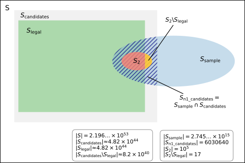

# Summary and Result

The `texelutil rndfen` functionality has been used to create a large sample of
positions in order to estimate the total number of legal chess positions.

The result is an unbiased estimate and a corresponding estimated standard
deviation:

```
N_legal_est ≈ 4.823692e44
std_dev     ≈ 0.001974e44
```

Or, with a 95% confidence interval:

```
N_legal ≈ (4.823692 +- 0.003870) * 1e44
        = [4.819822, 4.827561] * 1e44
```

# Estimation

## Sampling

`texelutil rndfen` samples from a space of size

```
N = 2 * 3969 * 2^62 * 2^30 * 5^30 * 6 ≈ 2.19645e53
```

The sample size was chosen so that roughly 6e6 legal positions would be included
in the sample:

```
for i in $(seq 0 9) ; do
    texelutil rndfen 600000 $((22+$i)) >rnd600k$i.txt
done
```

This means that the sample size was (`see PosGen::randomLegal()` for details):

```
N1 = 10 * floor(N / 4.8e44 * 6e5) = 2745567271070740 ≈ 2.746e15
```

## Excluding provably illegal positions

An automatic analysis was performed to determine the potentially legal
positions:

```
for i in $(seq 0 9) ; do
    cat rnd600k${i}.txt | texelutil -j 16 proofgame -f 2>debug >cand${i}.txt
done
cat cand?.txt | awk '{print $7}' | sort | uniq -c
54507525 illegal:
6030640 unknown:
```

So all positions except `N_n1_candidates` were illegal:

```
N_n1_candidates = 6030640
```

This first analysis does not try to determine how many of the `N_n1_candidates`
positions are legal and how many are illegal. Typically around 99.98 % of the
candidate positions turn out to be legal in later steps.

## Sampling from the set of candidate positions

Among the `N_n1_candidates` positions, a random sample of size
```
N2 = 1e5
```

was created using the following command:

```
cat cand?.txt | awk '$7=="unknown:"' | texelutil sample 100000 1 >sample100k.txt
```

These `N2` positions were analyzed with a combination of an automatic and a
manual method to determine the number of legal and illegal positions in the
sample:

```
N_s2_legal = 99983
N_s2_illegal = 17
```

The first step in the analysis used `texelutil proofgame -f -o ...` to find
proof games for most of the positions:

```
cat sample100k.txt | texelutil proofgame -f -o out 2>debug | tee status
cp out18 result1.txt
cat result1.txt | awk '{print $7}' | sort | uniq -c
  99346 legal:
    654 unknown:
```

The following step in the analysis invoked `texelutil` with various custom
flags, constructed proof games semi-manually, and produced manual proofs of
illegality, resulting in a total of 99983 proof games and [17 proofs of
illegality](17_illegal.txt).

## Estimating the total number of legal positions

Using this data, we can estimate that among the `N_n1_candidates` positions, the
number of legal positions is

```
N_n1_legal_est = N_n1_candidates * N_s2_legal / N2 ≈ 6029615
```

The estimated number of legal chess positions is therefore:

```
N_legal_est = N * N_n1_legal_est / N1 ≈ 4.823692e44
```

# Analysis

Introduce the following quantities (some were already introduced in the previous
section):

```
S = The set that contains all legal chess positions as a subset
N = The size of S (2.19645e53)
S_sample = A random sample from S
N1 = The size of S_sample (2.746e15)
S_n1_candidates = The computed subset of S_sample containing all potentially legal positions
N_n1_candidates = The size of S_n1_candidates (6030640)
S_2 = A random sample from S_n1_candidates
N2 = The size of S_2 (1e5)
N_s2_legal = The number of legal positions in S_2 (99983)
S_n1_legal = The set of legal positions in S_sample
N_n1_legal = The size of S_n1_legal (not computed exactly)
N_n1_legal_est = Estimated number of legal positions in S_sample (6029615)
N_legal_est = Estimated number of legal chess positions (4.823692e44)
```



Since `S_2` is a random sample from `S_n1_candidates`, its observed proportion
of legal positions can be multiplied by the size of `S_n1_candidates` to get an
unbiased estimate of the number of legal positions in `S_n1_candidates`. Since
`S_sample` contains the same legal positions as `S_n1_candidates`, this is also
an unbiased estimate of the number of legal positions in `S_sample`.

Similarly since `S_sample` is a random sample from `S`, its observed proportion
of legal positions can be multiplied by the size of `S` to get an unbiased
estimate of the number of legal positions in `S`, i.e. the number of legal chess
positions.

```
N_n1_legal_est = Estimate of number of legal positions in S_sample
               = |S_n1_candidates| * N_s2_legal / |S_2|
N_legal_est = |S| * N_n1_legal_est / |S_sample|
            = N_n1_candidates * N_s2_legal * N / N2 / N1
```

Define the following unknown quantities:

```
S_legal = The set of legal chess positions
N_legal = The size of S_legal (≈ 4.8e44)
S_candidates = The set of positions in S that are potentially legal
               according to the first automatic analysis
N_candidates = The size of S_candidates (≈ 4.8e44)
```

It follows that:
```
N_n1_candidates ~ Binomial(N1, N_candidates / N)
N_n1_legal | N_n1_candidates ~ Binomial(N_n1_candidates, N_legal / N_candidates)
N_s2_legal | N_n1_candidates, N_n1_legal ~ HyperGeometric(N_n1_candidates, N_n1_legal, N2)
```

It is possible to prove that `E(N_legal_est) = N_legal`, i.e. that the estimate
is unbiased. It is also possible to derive an exact expression for the standard
deviation, `SD(N_legal_est)`, but it requires some non-trivial calculations so
the details are deferred to a [separate document](estimator.pdf). (This assumes
that N_n1_candidates >= N2, which will be false with an extremely small
probability, unless the sample sizes are so small so the result would be
uninteresting anyway.) The result is that the estimate and the estimated
standard deviation should be computed like this:

```
p_hat = N_n1_candidates / N1
q_hat = (N2 - N_s2_illegal) / N2
n = N1
m = N2
a = (1 - p_hat) / (n * p_hat)
b = (1 - q_hat) / (m * q_hat)
N_legal_est = N * p_hat * q_hat
std_N_legal_est = N_legal_est * sqrt(a + b + a * b)
```

The estimate and confidence interval can be computed using the
[sample_estimate.py](sample_estimate.py) script, which assumes a normal
distribution when computing the confidence interval. For this sampling run, the
result is:

```
Estimate           : 4.823692e+44
Standard deviation : 1.974300e+41
Confidence level   : 0.95
Confidence factor  : 1.959964
Low                : 4.819822e+44
High               : 4.827561e+44
Half width         : 3.869557e+41
a                  : 1.6582e-07
b                  : 1.70029e-09
a / (a + b)        : 0.98985
a + b + a * b      : 1.6752e-07
```

The [sample_simulate.py](sample_simulate.py) script can be used to empirically
verify that the computed confidence interval has the claimed confidence level,
by simulating the sampling process a large number of times and checking how
often the computed confidence interval contains the true (assumed) number of
legal positions. Example output:

```
Simulations        : 1e+08
Parameter N_legal  : 4.8e+44
Parameter q        : 0.99983
Exact mean         : 4.8e+44
Exact SD           : 1.969396318120974e+41
Simulated mean     : 4.7999996816578824e+44
Simulated SD       : 1.969478823172038e+41
Mean estimated SD  : 1.969394889801426e+41
Confidence level   : 0.95
Confidence factor  : 1.9599639845400545
Empirical coverage : 0.95000535
```

As can be seen from the simulation, the normal approximation gives a very
accurate result.

# References

[1] ChessPositionRanking project: https://github.com/tromp/ChessPositionRanking

[2] Estimate from 2022: https://talkchess.com/viewtopic.php?p=924987#p924987

[3] Thoughts on scaling up the 2022 method: https://talkchess.com/viewtopic.php?p=923949#p923949
