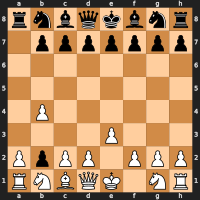
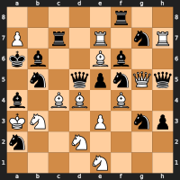

# Introduction

A *legal position* in chess is a position that can be reached from the standard
starting position by playing a sequence of legal moves.

A *proof game* for a position is a sequence of legal moves from the standard
starting position that leads to the given position, thereby proving that the
position is legal.

The `texelutil` command line tool has some functions related to proof games. See
[texelutil command line syntax](#texelutil-command-line-syntax) for detailed
usage instructions.

Computing a proof game for a chess position can be interesting in its own right,
but it can also be used as a building block in a procedure to estimate the
number of legal chess positions. This is described in the next sections.

# Determining the number of legal chess positions

Determining the exact number of legal chess positions is a very hard problem
that does not seem solvable with currently known technology. It is however
possible to compute approximations. The
[ChessPositionRanking](https://github.com/tromp/ChessPositionRanking) project
describes how this can be done. The basic principle is to construct a set S that
has the following properties:

1. The number of elements N in S is known, so the elements can be labeled
   1,2,...,N.

2. Given a number, it is possible to construct the corresponding element in S.

3. S contains all legal chess positions.

For this S it is possible to create a random sample by creating a random sample
of integers between 1 and N and then converting the integers to elements in S.
If the number of legal chess positions in this sample can be determined, an
estimate of the total number of legal chess positions can be computed by
assuming that the fraction of legal chess positions in the sample is the same as
the fraction of legal chess positions in S.

There are many ways to construct the set S. For example, S can be defined as
containing elements defined by the following properties:
* For each square on the chess board, the piece on that square is one of:
  * White king
  * White queen
  * White rook
  * White bishop
  * White knight
  * White pawn
  * Black king
  * Black queen
  * Black rook
  * Black bishop
  * Black knight
  * Black pawn
  * Empty
* The side to move (white or black) is specified
* The en passant target file is specified (using -1 if no en passant possible)
* The castling flags are specified

For this example N = 13^64 * 2 * 9 * 2^4 = 5.6e73. From the construction it can
be seen that all three properties listed above are satisfied. However, this
definition of S has the problem that it is so large compared to the number of
legal chess positions that any reasonably sized random sample of the set will
likely contain 0 legal chess positions. To be practically useful, S must
therefore have one more property:

4. N is not too large.

This is roughly (but see next section) what the ChessPositionRanking project
does. It defines S such that N = 8.7e45 and provides conversion functions
between integers and elements in S.

Given a suitable S, the remaining problem is to determine if a random element in
S is a legal chess position or not.

## Handling duplicate positions in S

It may be more convenient to let S be a multiset, so that the same element can
appear more than once in S. Such a multiset can also be used to estimate the
number of legal chess positions if the following property also holds:

5. For each legal position P_i, it is possible to calculate how many times (m_i)
   it occurs in the multiset S.

An unbiased estimate of the number of legal chess positions is then

```
(sum 1/m_i) / sample_size * N
```

where the sum is taken over all legal chess positions P_i in the sample. This is
how the ChessPositionRanking project actually defines S.

# Determining if a specific chess position is legal

To prove that a chess position is legal it is sufficient to construct a proof
game leading to the position.

To prove that a chess position is illegal is generally harder. Three main
methods are used:

1. Manually construct theorems of the form "if position P has property X then P
   is illegal". For example if a position has white pawns on a2, a3 and b2 it is
   illegal because the only white pawns that can reach a3 are the a2 and b2
   pawns, but no other white pawns can reach a2 or b2, so those pawns cannot
   have moved. Many simple rules of this type are implemented, for example:
   1. If the side to move can take the opponents king, the position is illegal.
   2. If the number of white pieces > 16, the position is illegal.
   3. If the number of white pawns + white queens > 9, the position is illegal.
   4. If black has 16 pieces and white has a double pawn, the position is
      illegal.

2. Relaxation. If the relaxed problem has no solution the original problem has
   no solution either (i.e. the position is illegal). The challenge is to
   construct the relaxation such that the relaxed problem can be solved but the
   relaxation is still strong enough so that most illegal positions correspond
   to a relaxed problem that does not have a solution. The key idea is to use a
   *proof game kernel*, which is described in the next section.

3. Analyze possible last moves leading to the position. For some positions it
   can be determined that there are no possible last moves leading to the
   position. One example is if the king is checked by 3 or more opponent
   pieces. This and many more situations are explained in the [Analyzing
   possible last moves](#analyzing-possible-last-moves) section.

## Proof game kernel

For positions that cannot be proven illegal by simple methods, the concept of a
*proof game kernel* (or *proof kernel* for short) is used. A proof kernel is a
sequence of moves in a special state space called the *proof kernel space*. The
idea is to construct this space so that:

1. Every sequence of legal chess moves has a corresponding proof kernel.
2. The proof kernel space is small enough to be exhaustively searched in a
   reasonable amount of time for typical random chess positions.
3. Every normal chess position has a corresponding state in the proof kernel
   space.

Given such a proof kernel space it would be possible to prove that a position P
is illegal by first converting the position to the corresponding state S in the
proof kernel space, then performing an exhaustive search of the proof kernel
space to determine that the state S can never be reached from the initial
position.

A state in the proof kernel space is defined as follows:

1. There are 8 files, corresponding to the a-h files in a normal chess
   position.
2. Each file contains 0 or more pawns in a specified order. This arrangement of
   pawns is referred to as a *pawn column*. Note that there are no actual squares
   in this state. Only the order of the pawns matters.
3. The number of non-pawn pieces for each piece type and color is included in
   the state, but the position of the non-pawn pieces are not included in the
   state (not even the file).
   1. Light-squared bishops and dark-squared bishops are considered to be
      different pieces types, represented by LB and DB respectively.
   2. Kings are not included, since each side always has exactly one king.

Legal moves in the proof kernel space are all types of captures (including
capture promotions), but non-captures are not considered legal. Because of the
way the space is defined, non-capture moves would not change the state anyway.

As an example, consider the position after the moves "e4 d5 exd5" have been
played from the starting position. The corresponding state in the proof kernel
space would be:

```
File a: wP, bP
File b: wP, bP
File c: wP, bP
File d: wP, wP
File e: bP
File f: wP, bP
File g: wP, bP
File h: wP, bP
1*wQ, 2*wR, 1*wDB, 1*wLB, 2*wN
1*bQ, 2*bR, 1*bDB, 1*bLB, 2*bN
```

A move in the proof kernel space is described by a string that has the following
8 parts:

1. "w" or "b" indicating the color of the moving piece. This information is
   needed because unlike regular chess moves, the same side can make several
   moves in a row in the proof kernel space.

2. The type of the moving piece. However, because the position of non-pawn
   pieces is not included in the state, this part is either "P" or an empty
   string.

3. The file of the moving piece. One of a,b,c,d,e,f,g,h. Again, because the
   position of non-pawn pieces is not part of the state, this part is an empty
   string if the moving piece is not a pawn.

4. The index in the pawn column the moving piece had before it moved. The index
   is >= 0, where 0 corresponds to the pawn closest to the first row on a
   regular chess board. This part is also an empty string for a non-pawn move.

5. The string "x", indicating that this is a capture move.

6. The type of the piece being captured. For non-promoted pieces, this is one of
   Q,R,LB,DB,N,P. For pieces that were not present in the initial state
   (i.e. they appeared because of pawn promotion), the file of the pawn that
   promoted is used instead.

7. The file of the moving piece after it has moved. One of a,b,c,d,e,f,g,h.
   Empty string for moves not involving pawns.

8. The index in the pawn column of the moving pawn after the capture, or the
   index of the captured pawn before it was captured. For moves not involving
   pawns, this is an empty string. For pawn promotions, the promoted piece is
   used instead of the index.

Some examples could make this easier to understand:

| Move type | Example | Description |
| :---      | :---    | :---        |
| pawn takes pawn          | wPc0xPb1 | First c pawn takes second pawn on b file
| pawn takes piece         | wPc0xRb0 | First c pawn takes rook on b file. Pawn placed at index 0 in b file
|                          | wPc0xRbQ | First c pawn takes rook on b file and promotes to queen
| pawn takes promoted pawn | wPc0xfb0 | First c pawn takes piece on b file coming from promotion on f file
|                          | wPc0xfbR | Like above and promoting to a rook
| piece takes pawn         | bxPc0    | Black piece takes first pawn on c file
| piece takes piece        | bxR      | Black piece takes white rook

A proof kernel move sequence can be constructed from a sequence of legal regular
chess moves basically by ignoring all non-capture moves and converting the
capture moves to the format specified above.

### Exhaustive search in the proof kernel space

Most legal positions have 27-28 remaining pieces (including kings) on the board,
which means that the corresponding proof kernel contains 4-5 moves, since each
move is a capture. There are on average around 600 legal moves for a state in
the proof kernel space, so an exhaustive search would take quite a long time to
complete. There are some tricks available to speed up the search though:

1. Transpositions. Several move sequences can lead to the same state. After a
   state has been searched, if it is found that there is no path from that state
   to the goal state, this fact can be stored in a cache. When the same state is
   reached again, the search can be pruned at that node.

   Note that unlike in a chess engine, the purpose of this search is to prove
   with mathematical certainty that a position does not have a proof kernel, so
   approximate methods like assuming there are no hash key collisions cannot be
   used.

2. Pruning. If it can be proven without further search that the current state
   cannot lead to the goal state, the search can be pruned. A number of pruning
   methods are used.

   1. A pawn column is said to be *complete* if it is equal to the pawn column
      in the goal state, or if it can become equal by performing some
      non-capture promotions of pawns in the column. With this definition it
      follows that a move can at most make two pawn columns complete. This means
      that if the number of incomplete pawn columns is larger than 2 times the
      number of remaining moves, the goal state cannot be reached, so the node
      can be pruned.

      In fact, this rule can be strengthened by observing that only two adjacent
      pawn columns can be made complete by a move. The details are explained in
      the `ProofKernel::minMovesToGoal()` function in the source code.

   2. If the number of remaining pawns for one color are too few to allow
      promotions to create enough pieces of all types, the node can be pruned.

   3. If a pawn column contains too few pawns, additional captures are needed,
      but since a pawn can only move to an adjacent column in each move,
      additional captures are needed if the closest available pawn is far away.
      If the number of required captures is larger than the number of remaining
      moves, the node can be pruned.

   4. If no additional captures are made, the maximum number of dark/light
      bishops after pawn promotions is determined by the current pawn columns.
      If the number is too low, additional captures are needed. If the number of
      needed additional captures are larger than the number of remaining moves,
      the node can be pruned.

3. Move ordering. By trying the most promising moves first, the number of nodes
   required to find a solution can be reduced. The
   `ProofKernel::minMovesToGoal()` function is used for move ordering, so moves
   that seem to get closer to the goal state are tried first.

   Note that unlike the pruning techniques, move ordering only helps if the
   search problem actually has a solution.

These techniques work quite well in practice. Most positions are either illegal
or so "close" to illegal that pruning removes most of the search tree, or they
are legal "by a wide margin" so that move ordering does a good job of finding a
solution without having to explore too much of the search space.

There are of course hard positions too, where a large search tree is needed, but
those positions tend to be rare in random samples of positions. The total time
required to search all proof kernel search spaces for the 1 million sample of
positions from the ChessPositionRanking project (containing 56011 legal
positions) is around 3 minutes on a 24 core computer.

### Blocked squares

If it can be proven that a square contains a certain piece in the initial
position and the same piece in the goal position, and that the piece cannot ever
move during the proof game, such a square is called a *blocked square*. A
blocked square implies that no other piece can ever be on that square.

An example of a blocked square is if the goal position contains a white pawn on
a2. Because pawns always move forward and there is initially no pawn on the
first row, the only white pawn that can ever be on a2 is the pawn that is
already there in the starting position. Other examples of blocked squares are
the initial king and/or rook squares if castling is possible in the goal
position.

Blocked squares can also cause additional squares to be blocked. For example, if
b7 and d7 are blocked and there is a black bishop on c8 in the goal position,
the c8 square is blocked too.

Blocked squares are important in the proof kernel search space, because they
make it possible to prove that some proof kernels cannot correspond to a proof
game. For example:

* if the a7 square is blocked, no white pawn can ever promote from the a file.

* If the a8 square is blocked, the only white pawn promotions possible from the
  a file are capture promotions to the b8 square.

* If the e8 square is blocked and contains a black king, states having a white
  pawn on f7 can be pruned, because the pawn would check the black king that
  cannot move, so the only possibility is to capture the pawn on f7. If there is
  a proof kernel containing such a capture, there is also a proof kernel where
  the pawn was captured before it reached f7. Consequently it can be concluded
  that no white pawn can promote from the f file.

  This means that the following position is illegal if black has castling rights:

  | Pf2 could not have promoted without moving Ke8 |
  | :---: |
  |  |

### Trapped bishops

If a pawn promotion square has the property that a bishop placed on that square
would be unable to move because of adjacent blocked squares, this fact is taken
into account in the proof kernel search. An example is the a8 square if the b7
square is blocked. This situation has two consequences:

* There can be at most one bishop promotion on the square.

* If there is no bishop (of the right color) on the square in the goal position,
  there can be no bishop promotions on the square.

These rules make it possible to prove the following positions illegal:

| Promoted bishop on a8 cannot reach c4. | Only one bishop promotion possible on a8. |
| :---: | :---: |
|  |  |

## Extended proof game kernel

Consider the following two positions, where the first is illegal and the second
is legal.

| Illegal | Legal |
| :---: | :---: |
|  |  |

Both positions have a proof kernel that contains the single move "bPa1xLBb0". In
the first example the position is illegal even though it has a proof kernel
because the capture can only happen on the b2 square, but the light-squared
bishop cannot get to the dark b2 square. The second position is legal because
the black pawn could have captured the light-squared bishop on the b3 square.

To be able to discriminate between such positions, the concept of an *extended
proof game kernel* (or *extended proof kernel* for short) is introduced. An
extended proof kernel contains the following information:

* The same information as in a regular proof kernel.

* Information about the rows where captures take place.

* Information about non-capture pawn moves (including start and end row) needed
  to make subsequent pawn captures possible.

Using the fact that pawns can only move forward and the known positions of the
pawns in the initial and goal positions, constraints can be defined between the
rows involved in the extended proof kernel. This can be formalized as a
*constraint satisfaction problem* (or *CSP* for short), by introducing variables
for the rows in the extended proof kernel.

In the illegal example above, the following variables can be introduced:
* v1 : The row of the black a pawn immediately before it captures the bishop.
* v2 : The row of the black a pawn immediately after it captures the bishop.
* v3 : The row of the white b pawn immediately before the bishop is captured.

For all such variables it is known that 2 <= v <= 7 since pawns cannot be on the
first/last rows. In this example the following is also known:
1. v1 > 2, since the white a pawn is at a row >= 2 and the black a pawn is above
   the white a pawn.
2. v2 = v1 - 1, since the pawn capture moves the pawn down one row.
3. v2 < v3, since the black pawn ends up below the white b pawn after the
   capture.
4. v3 <= 3, since the white b pawn is on row 3 in the goal position and pawns
   cannot move backwards.
5. v2 is odd, since the light-squared bishop can only reach odd rows on the b
   file.

This CSP does not have a solution, since 3 and 4 imply v2 < 3, i.e. v2 = 2, but
5 says v2 must be odd.

For random positions the constructed CSPs typically have around 30-40 variables
and 35-45 constraints. CSPs can be simplified using a technique called *arc
consistency*, and it turns out that this is enough to be able to quickly solve
the CSPs encountered when analyzing extended proof kernels.

## Analyzing possible last moves

Some positions can be proven illegal by considering what the last move leading
to the position must have been. A generic reverse move generator is used to get
a list of candidate positions that could have preceded the position. If all
candidate positions can be proven illegal, it can be concluded that the original
position is illegal too.

The reverse move generator can statically determine that some moves are illegal.
See [texelutil revmoves](#revmoves) for details. Two examples that are proven
illegal directly by the reverse move generator are:

| How did Ba5 get there? | Bishop to c6 must have been a capture |
| :---: | :---: |
|  |  |

The first position is illegal because black is checked by the bishop on a5, but
there is no way for the bishop to have gotten there in the last move. The second
position is illegal because the bishop on c6 must have captured a piece to get
there, since otherwise the black king could have been captured by Qb5 before the
last move. However, since black has 16 pieces there is no piece that could have
been captured on c6.

In many cases the reverse move generator cannot reject all candidate moves, but
the position might still be illegal. One idea is to recursively analyze all
possible non-rejected prior positions to the goal position. In general there is
no reason to believe that a prior position would be easier to analyze than the
original position, so always trying the recursive analysis could lead to an
algorithm that would never finish. Therefore only the following cases are
handled recursively:

1. The last move is a capture. Since there is a finite number of available
   captures, this does not lead to infinite recursion.

2. The side to move in the goal position is in check. Since both sides cannot
   check each other on every move indefinitely, this does not lead to infinite
   recursion either.

3. If the recursive analysis leaves only one possible last move, the prior
   position is analyzed recursively even if it does not satisfy 1 or 2. Since
   there is only one possible last move, this does not lead to exponential
   search tree growth.

This algorithm can handle fairly complicated cases, for example:



The white king is checked by the knight on b5, so the last move must have been a
knight move from either c3 or d6 to b5. Proof kernel searches can determine that
the last move was not a capture, because then the prior positions would not have
a proof kernel. Since white is in check in the goal position, case 2 applies, so
both prior positions are recursively analyzed. In both cases it is found that
the white bishop on c4 must have gotten there by capturing a piece, since
otherwise the black king could have been captured. Proof kernel searches however
show that all positions before a capture on c4 lack a proof kernel. Therefore it
is concluded that the position is illegal.

## Constructing a proof game

If a position cannot be proven illegal using the techniques described in the
previous sections, an attempt is instead made to find a proof game for the
position. This is done in two steps:

1. Convert the extended proof kernel to a sequence of corresponding real chess
   moves. This sequence of moves is called the *initial path*.

2. Perform A* search to try to find a sequence of moves from the position at the
   end of the initial path to the goal position.

Since A* search is also used to solve sub problems encountered in step 1, A* is
described first.

### A* search

A* search is a general algorithm to find a path in a graph from a start node to
a goal node. The idea is to use a heuristic function to estimate the optimal
distance from a given node to the goal node. The algorithm uses a priority queue
to keep track of nodes found so far. The priority queue is ordered by the cost
to reach the current node from the start node plus the estimated cost to reach
the goal node from the current node.

How well the algorithm works depends on the heuristic function. For example, if
the heuristic function is identically zero the algorithm reduces to
breadth-first search, which would not be able to solve non-trivial problems in a
reasonable amount of time. The other extreme is if the heuristic function is
always equal to the optimal cost, in which case A* search would find an optimal
solution in linear time. In general you want the heuristic function to be as
large as possible without overestimating the optimal cost.

If the heuristic function never overestimates the optimal cost to get to the
goal, A* is guaranteed to find an optimal solution. Such a heuristic is called
*admissible*. Finding an optimal solution is however of no use if you only want
to determine if a given chess position is legal or not. A long proof game is
just as valid as a short proof game.

Weighted A* search is a way to speed up the search by giving up on finding the
shortest path. This is implemented by ordering the priority queue based on the
following value:

```
cost_from_start(node) + w * heuristic(node)
```

where w > 1. w = 1 corresponds to regular A* search. Using w = 5 works well in
practice for finding proof games.

#### Heuristic function

A common way to construct a heuristic function for A* search is to solve a
relaxed problem. This also automatically makes the heuristic admissible.

For the proof game problem, the relaxed problem is constructed by assuming that
pieces do not interfere with each other. For example, if a piece needs to move
from a2 in the start position to c8 in the goal position, a shortest path from
a2 to c8 is computed assuming that no other pieces (except for blocked squares)
are present on the board. There are well known algorithms for solving such
shortest path problems efficiently.

In many cases it is not a given which piece in the start position should go to
which square in the goal position. Consider the following example:

| Start | Goal |
| :---: | :---: |
|  |  |

The knight on a2 can reach c3 in 1 move and c8 in 4 moves. The knight on f2 can
reach c3 in 2 moves and c8 in 3 moves. If the a2 knight goes to c3 and the f2
knight goes to c8, the total cost is 1+3=4. If the a2 knight goes to c8 and the
f2 knight goes to c3, the total cost is 4+2=6. Finding the best way to decide
which piece should go where can be formulated as an instance of the *assignment
problem*, which can be solved efficiently using the *Hungarian method*.

A small complication is that pawn promotions, including under-promotions, need
to be taken into account when formulating the assignment problem.

Blocked squares are taken into account when computing how many moves are needed
to move a piece from one square to another. Suppose in the previous example that
there was also a pawn on d6 in both the start and goal position. That pawn would
then be blocked (unable to move), so no other piece could ever be on d6. This
would mean that 5 moves would be required to move the knight from f2 to c8.
Blocked squares can easily be taken into account when formulating the shortest
path problems.

For kings the shortest path calculation also takes into account that if a pawn
is blocked, the squares attacked by that pawn can never be used by the opponent
king. For example:

| Start | Goal |
| :---: | :---: |
|  |  |

The white king needs 10 moves to get from a3 to a6 because it cannot use the b4,
 c4 and e4 squares.

#### Statically determining illegal positions

Another important task for the heuristic function is to determine if it is
impossible to reach the goal position from the current position. In that case
the heuristic can return "infinity" to cause the A* search to immediately prune
the node. The heuristic function can handle the following cases:

* There are too few remaining pieces in the current position.

* The assignment problem has no solution. This can happen for several reasons,
  but a common case is that a bishop needs to get to a8 (or another corner
  square), but there is a blocked pawn on b7 preventing any bishop from reaching
  a8.

* There are too few pawns inside a "pawn cone". Consider a white pawn on f5:

  | Squares where a pawn can reach f5 |
  | :---: |
  |  |

  The marked squares correspond to squares from which a white pawn can reach f5,
  assuming there are enough available captures for the pawn. Because of the way
  pawns move, the number of white pawns in such a pawn cone can never increase.
  (For black the pawn cone has the opposite direction.) This means that if a
  pawn cone is found that contains more pawns in the goal position than in the
  current position, the goal position cannot be reached.

  If there are a limited number of available captures, truncated pawn cones are
  also considered. For example:

  | Squares where a pawn can reach f5 using at most 1 capture |
  | :---: |
  |  |

  If the goal position has a pawn at the top of the cone (f5), but the current
  position has no pawns in the cone, the goal position cannot be reached.

* Deadlocks. If there is a set of pieces where no piece can move unless a
  different piece in the set is moved first, it means that none of the pieces in
  the set can move. If any of the unmovable pieces are not at their goal
  squares, this means that the goal position cannot be reached. If all unmovable
  pieces are at their goal squares, it means that those squares are blocked,
  which can prevent some other piece from reaching its goal square. For example:

  | Start | Goal |
  | :---: | :---: |
  |  |  |

  A pawn needs to promote to a knight on h8, but since none of the Ph7, Rh8, Bg8
  pieces can move, those squares are blocked and prevent the promotion.
  Therefore the goal position is unreachable. If the h7 pawn had instead been on
  h6 the goal position would have been reachable. (Move away rook, promote the
  h6 pawn, move the rook back, move h3 to h7.)

  Note that deadlock detection is only valid if there are no remaining captures.
  Otherwise the deadlock could potentially be resolved by capturing one of the
  involved pieces.

#### Improving the success rate

For some positions the A* search has trouble finding a solution. The following
additional methods are used to improve its reliability:

* If the last move before the goal position is reached can be proven by the
  reverse move generator to be non-reversible (i.e. a capture or a pawn move),
  but more than one such move is possible, the algorithm picks one of the moves
  arbitrarily and assumes that will be the last move. For example:

  |  Last move must be Bxg3+ |
  | :---: |
  |  |

  It can be seen that the last move must be Bxg3+, but there is more than one
  choice, since the bishop could have come from either f4 or h2, and it could
  have captured e.g. a rook or a queen. By assuming a last move, e.g. Bh2xQg3+,
  the A* search can instead try to find a solution for the position before that
  move. This avoids the problem that the heuristic function could otherwise make
  the search try to get the bishop to g3 too early.

* During the A* search there will often be many nodes having the same lowest
  estimated total cost. Any of those could be picked from the priority queue.
  Some choice may however make the remaining search considerably easier than
  other choices. The following heuristics are used to break ties, where the
  first rule that can break the tie is used:

  1. Captures are tried before non-captures. The idea is that early captures
     reduce the size of the remaining search space.

  2. Moves getting kings closer to their target squares are tried early. The
     idea is that kings move slowly and must also avoid attacked squares while
     moving, so getting them close to their targets early should simplify
     finding a solution.

  3. Pawn promotions are tried early. The idea being that such moves reduce the
     number of choices later in the search.

  4. Pawn moves are tried early. The idea being that such moves reduce the
     number of choices later in the search.

  5. Otherwise, pick a move randomly.

  The random choice turns out to be very helpful. The first time the A* search
  is run it is limited to exploring at most 50000 nodes. If no solution is found
  the A* search is restarted with a slightly larger node limit (~20%), but it
  also uses a different random number seed each time it is restarted.

* Because the heuristic function used by the A* search ignores pieces
  interfering with each other, it can sometimes lead to a position where the
  heuristic score is very low but several moves are still needed to reach the
  goal position. For example:

  |  Goal | Best found by search |
  | :---: | :---: |
  |  |  |

  In the best node found during search, only two pieces are not at their goal
  squares. Ra1 needs to move to a4 and Ba7 needs to move to g1. Because the
  heuristic function ignores other pieces, it concludes that at least one move
  is needed for Ra1 to get to a4 and one move for Ba7 to get to g1. It therefore
  returns the value 2 (plies). The real number of moves required to reach the
  goal position is much larger though, because several pieces block the movement
  of the rook and bishop, so they first have to move away, then move back after
  the rook/bishop has moved to its target square.

  To overcome this problem, if the regular A* search fails to find a solution, a
  shorter A* search is tried starting from the best position found by the
  regular search and using a different non-admissible heuristic. This heuristic
  also considers pieces that are blocking sliding pieces from getting to their
  target squares and estimates the number of moves required to move the blocking
  pieces away and to move them back in case they already were on their target
  squares. This heuristic might over-estimate the number of required moves, but
  this is not a problem since it is not important to find the shortest solution.

  For this example the alternative heuristic makes the search find a solution
  after around 6000 nodes (2 seconds) even though the regular heuristic fails to
  find a solution after 3 million nodes (> 5 minutes).

### Computing the initial path

To compute an initial path (a sequence of standard chess moves) corresponding to
an extended proof kernel, the following steps are used:

1. "Enhance" the extended proof kernel move sequence by converting non-pawn
   moves like Ra1-f6 to a sequence of moves obeying the piece movement rules of
   chess, e.g. Ra1-a3, Ra3-f3, Rf3-f6.

   This enhancement is implemented as a backtracking search that also tries to
   move away pieces that are preventing other pieces from reaching their target
   squares, and also reorders moves to resolve conflicts.

2. Play out the extended proof kernel moves on a special type of board where
   several pieces are allowed to be on the same square.

3. After all moves have been performed, look for squares having more than one
   piece and move the excess pieces to some other free squares.

4. If kings are attacked by opponent pieces, move the kings to some unattacked
   squares.

5. If pieces on the first/last row are not present, but the pieces are blocked
   by own pawns, try to advance the pawns so that the pieces are able to move to
   the squares where they are going to be captured.

6. Use A* search to try to find a sequence of moves from the start position to
   the constructed position matching the end of the extended proof kernel move
   sequence.

7. If no solution is found, split the extended proof kernel move sequence in two
   parts and invoke the algorithm recursively on the first and second half.

This algorithm is "incomplete", meaning that it can fail to find a solution even
if one exists and it is given unlimited computation time. Nevertheless it works
quite well in practice and manages to compute an initial path for well over 99%
of encountered random legal positions.

#### Random proof kernel

For difficult positions finding a solution is sometimes easier if a different
proof kernel is used when constructing the initial path. The `-rndkernel`
texelutil option can be used to randomize the move ordering during proof kernel
search, thereby letting the search find different proof kernels than the default
search would find. This option is not used by default since the search can take
significantly longer if the move ordering is bad.

Using several attempts with randomized proof kernel search and different random
number seeds typically makes it possible to find proof games for around 99.9% of
encountered random legal positions.

## Difficult cases

It seems inevitable that some positions will be too hard to solve automatically
by the program. This does not mean that a human must solve the problem
completely unassisted though. If the program fails to find a solution it logs
the found proof kernel, the extended proof kernel, the initial path (if found)
and the moves leading to the best position found during search (if found). This
information can be inspected by the human to determine what the problem is.

If the position is legal but no proof game is found, the move sequence
corresponding to the best position found during search could be loaded into a
chess GUI and adjusted by the human. The program could then be asked to try
again to find a proof game starting from the adjusted move sequence.

If the position is illegal but still has an extended proof kernel, the
`texelutil proofkernel` function can be used to get a list of all possible proof
kernels. This list can sometimes be used to prove useful properties such as "the
white a pawn must capture the black b pawn" or "the black c pawn does not
capture anything", which can then be used as building blocks in the full
illegality proof.

# `texelutil` command line syntax

## Syntax

The following commands related to proof games and legal chess positions are
available:

```
texelutil proofgame [-w a:b] [-d] [-m maxNodes] [-v] [-na] [-nokernel]
                    [-i "initFen"] [-ipgn "initPgnFile"] "goalFen"
texelutil proofgame -f [-o outfile] [-retry] [-rnd seed] [-rndkernel]
texelutil proofkernel [-i "initFen"] "goalFen"
texelutil revmoves "fen"
texelutil rndfen n [seed]
```

## `proofgame` - single position

To search for a proof game for a single position, use the following syntax:

```
texelutil proofgame [-w a:b] [-d] [-m maxNodes] [-v] [-na] [-nokernel]
                    [-i "initFen"] [-ipgn "initPgnFile"] "goalFen"
```

The only required argument is *goalFen*, which specifies the position in
Forsyth-Edwards Notation (FEN). Note that quotes are required around *goalFen*
since FEN strings contain spaces.

The following options are supported:

* `-w a:b`

  Specify the weight ratio for the weight A* search. The default is 1:5. Using
  1:1 would always find a shortest solution first, but the program may run out
  of memory before a solution is found.

* `-d`

  Use dynamic weighting. It does not seem to help much for most problems though.

* `-m maxNodes`

  If a solution has not been found after exploring *maxNodes* nodes, give up.
  Without this option the program never gives up, but will eventually run out of
  memory instead.

* `-v`

  Print more information about the search progress. Every time a position is
  found that is "closer" to the goal than the previously best found position,
  the corresponding move sequence is printed. This can be useful for positions
  that are too hard for the program to solve. Having the best attempt available
  can make it easier to a human to construct a proof game.

* `-na`

  Use a special non-admissible heuristic function for the A* search that
  attempts to resolve position where one or a few pieces need to move past a
  large number of other pieces to reach their target positions. This flag
  sometimes helps if the search gets stuck.

* `-nokernel`

  Skip the initial proof kernel search and last move analysis and instead
  immediately start the A* search. This can be needed for end game positions
  where the proof kernel search would take too much time because of the
  corresponding proof kernel search space being too large when many captures are
  available.

* `-i "initFen"`

  Instead of finding a move sequence from the standard starting position, find a
  sequence from the position specified by the *initFen* FEN string.

* `-ipgn "initPgnFile"`

  Only search for solutions that start with a specified sequence of moves. The
  move sequence is taken from the last game in the PGN (Portable Game Notation)
  file with name *initPgnFile*. Using this option makes it possible to find
  solutions to problems that would otherwise be too hard for the A* search to
  solve.

### Example

```
texelutil proofgame -v -w 1:5 \
    "r1bqkb1r/1ppp1ppp/p1n2n2/4p3/B3P3/5N2/PPPP1PPP/RNBQ1RK1 b kq - 0 1"
```

## `proofgame` - multiple positions

To determine the legality status of a list of chess positions in FEN format, run:

```
cat input.txt |
  texelutil proofgame -f -o outfile [-retry] [-rnd seed] [-rndkernel] 2>debug |
  tee status
```

or:

```
cat input.txt |
  texelutil proofgame -f [-retry] [-rnd seed] [-rndkernel] \
  > output.txt
```

`input.txt` is a file containing FEN positions, one position per line.

`output.txt` is a file that contains FEN positions and additional information
about the legality status of the corresponding position. The output format uses
one line per position, so each line can become rather long. The output format is
also valid as input to `texelutil proofgame -f`, so multiple passes over the
data can be easily performed.

The following options are supported:

* `-o outfile`

   Run multiple passes over the data. The result of a pass is written to the
   file outfileNN, where NN = 00, 01, 02, etc. The result for one pass is used
   as input to the next pass.

   This option should normally be used. Otherwise it is required to run multiple
   passes over the data to be able to determine even a single legal position.

* `-retry`

   If the input file contains positions where a previous run gave up trying to
   determine the legality, use the `-retry` option to ignore the failure and
   make the program start from scratch to try to determine the legality for
   those positions. This option is useful to try again to solve difficult
   positions using different parameters.

* `-rnd seed`

  Specify the random number generator seed value. If not specified, the value
  `0` is used. The randomness is used to break ties in the A* search. For
  difficult positions using a different seed can help the search to avoid
  getting stuck.

* `-rndkernel`

  Makes the proof kernel search randomize its move ordering to encourage finding
  different proof kernels. For difficult positions, starting from a different
  proof kernel can make it easier to find a proof game.

### Example

```
cat fenfile.txt | texelutil proofgame -f -o out 2>debug | tee status

lastOut=$(ls out* | tail -n 1)

# Determine number of legal positions
cat ${lastOut} | grep ' legal: ' | wc -l

# Determine number of illegal positions
cat ${lastOut} | grep ' illegal: ' | wc -l

# Determine total number of positions
cat fenfile.txt | wc -l
```

## `proofkernel`

To list all possible proof game kernels corresponding to an initial and goal
position, run:

```
texelutil proofkernel [-i "initFen"] "goalFen"
```

If the `-i` option is omitted the standard starting position is used.

### Example

```
$ texelutil proofkernel "rnbqkbnr/ppp2ppp/8/3P4/3p4/8/PPP2PPP/RNBQKBNR w KQkq - 0 1"
 wPe0xPd1 bPe0xPd0
 bPe1xPd0 wPe0xPd1
```


## `revmoves`

To determine all possible legal reverse moves for a chess position, use the
following command:

```
texelutil revmoves "fen"
```

For a given position, the reverse move generator calculates a list of
moves and corresponding undo information, such that for all legal
positions that lead to the target position by playing a suitable
legal move, that legal move is included in the list.

It is too hard to make sure the list never contains moves
corresponding to illegal previous positions, because that would
require determining if an arbitrary position is legal. Some easy
cases are handled though:

* Moves that are invalid because the resulting piece counts (taking
  promotions and captures into account) are impossible.
* Moves that are invalid because king capture was possible before the
  move.
* Moves that are invalid because the en passant square does not match
  a double pawn push.

### Example

```
$ texelutil revmoves "rnbqkbnr/pppB1ppp/4p3/1Q6/4P3/8/PPPP1PPP/RNB1K1NR b KQkq - 0 1"
c6d7 captP: Q castle: KQkq ep: -
c6d7 captP: R castle: KQkq ep: -
c6d7 captP: B castle: KQkq ep: -
c6d7 captP: N castle: KQkq ep: -
c6d7 captP: P castle: KQkq ep: -
```


## `rndfen`

To generate approximately n legal positions (and around 9*n illegal positions)
in FEN format, run:

```
texelutil rndfen n [seed]
```

An optional random number generator seed value can be specified. If not
specified, a random seed based on the current time is used.

The function generates random positions from a set S having size N = 2 * 3969 *
2^62 * 2^30 * 5^30 * 6 = 2.2e53. Since N is around 4.6e8 times larger than the
number of legal chess positions, printing all samples would produce too many
illegal positions to be useful. Therefore positions that can easily be
determined to be illegal are not printed.

Combined with `texelutil proofgame` this function can be used to estimate the
number of legal chess positions.

1. First use `texelutil rndfen n [seed]` to generate a list of candidate
   positions. Let *mult* be the reported multiplier.

2. Compute the actual number of legal positions, *nLegal*, in the list using
   `texelutil proofgame -f -o ...`.

3. The quantity *mult* * *nLegal* is an unbiased estimate of the number of legal
   chess positions.

Note that this function is rather slow. If a large number of random legal
positions is wanted, it is much more efficient to use the ChessPositionRanking
software. ```texelutil rndfen``` exists primarily to have an independent
implementation that can be compared statistically with random positions
generated by the ChessPositionRanking software.


### Example

```
texelutil rndfen 10 | texelutil proofgame -f -o out 2>/dev/null
```

# References

[1] ChessPositionRanking project: https://github.com/tromp/ChessPositionRanking

[2] Forsyth-Edwards Notation: https://en.wikipedia.org/wiki/Forsyth%E2%80%93Edwards_Notation

[3] Portable Game Notation: https://en.wikipedia.org/wiki/Portable_Game_Notation

[4] Proof game kernel idea: https://news.ycombinator.com/item?id=28424931

[5] Constraint satisfaction problem: https://en.wikipedia.org/wiki/Constraint_satisfaction_problem

[6] Arc consistency: https://en.wikipedia.org/wiki/Local_consistency#Arc_consistency

[7] A* search algorithm: https://en.wikipedia.org/wiki/A*_search_algorithm

[8] Breadth-first search: https://en.wikipedia.org/wiki/Breadth-first_search

[9] Shortest path problem: https://en.wikipedia.org/wiki/Shortest_path_problem

[10] Assignment problem: https://en.wikipedia.org/wiki/Assignment_problem

[11] Hungarian method: https://en.wikipedia.org/wiki/Hungarian_algorithm
