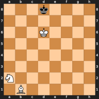
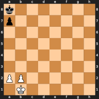
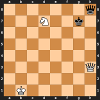
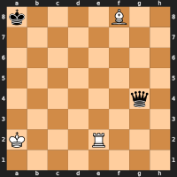
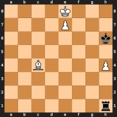

# How Texel probes endgame tablebases

Texel uses endgame tablebases somewhat differently than other chess
engines. Both Syzygy and Gaviota tablebases can be used simultaneously to
complement each other. This document describes how the tablebase probing works.

# Goals

* Emulate DTM50 tablebases using publicly available tablebase files.

  A DTM50 tablebase contains information needed to force a mate in the fewest
  possible moves while taking the 50-move draw rule into account. This is what a
  typical chess engine is already trying to achieve in non-tablebase
  positions. Therefore I consider DTM50 to be the metric most consistent with
  the normal behavior of a chess engine.

* Correctly handle the 50-move draw rule.

  Texel is designed to play according to the FIDE laws of chess and must not
  incorrectly think that it can win in a position where more than 50 reversible
  moves are required to force a mate. This goal also means that Texel is not a
  good choice for analysis of correspondence games where the 50-move draw rule
  is not used.

* Always play game-theoretically optimal moves when the root position is a
  tablebase position, even if the half-move clock is non-zero.

  In order to be a useful analysis tool Texel should be able to find optimal
  moves (i.e. preserving a win or draw) in tablebase positions even if the
  half-move clock is larger than 0 and even if sub-optimal moves have been
  played in order to reach the current position.

* Consistent hash table scores.

  Information stored in the transposition table must not have different score
  ranges depending on if the root position is a TB position or not. This makes
  it possible to move back and forth in analysis mode without clearing the hash
  table and without getting inconsistent results.

* Small probe overhead before a TB position is reached in a game.

  Retrieving tablebase information during game play and during analysis should
  be as efficient as possible, both for single threaded and multi-threaded
  search. This implies that the algorithm should intelligently decide which
  tablebase type (WDL, DTZ, DTM) to probe.

* Swindle mode to improve practical chances against imperfect opponents.

  "Reasonable" moves should be played in order for the engine to not look stupid
  to a human observer and to improve winning chances when playing against
  opponents that do not have tablebase information available. For example, in a
  drawn KRBKR endgame the side with the bishop should not give up its rook even
  if that preserves the draw. Swindle mode can also be effective against
  opponents that have imperfect tablebase information available, such as only
  Gaviota or Nalimov tablebases that ignore the 50-move draw rule.

# Implementation

A tablebase probe in Texel can return an exact score or an upper or lower bound,
depending on circumstances. The returned score is 0 for a draw, or a mate score
for a won/lost position. Note that there is no "TB win" constant in Texel.

* For a Gaviota DTM probe the mate score is directly available from the
  tablebase.

* For a Gaviota WDL probe a mate score bound is obtained by looking up the
  longest possible mate for the given tablebase class in a table that is
  included in the Texel source code.

* For a Syzygy WDL probe a mate score bound is obtained by looking up the
  longest possible mate from a table indexed by the tablebase class and the
  maximum number of remaining pawn moves. This table is computed using a dynamic
  programming algorithm when the engine starts.

* For a Syzygy DTZ probe a mate score bound is obtained by a look-up from the
  same table as in the Syzygy WDL case, but the DTZ value is used for the
  current position instead of assuming the largest possible DTZ value for the
  given tablebase class.

A tablebase probe thus returns similar information as a transposition table
probe, and similar logic is used to decide if the probe result can be used to
cut off the search tree. The main difference is that tablebase probes behave as
if the draft is infinite, because they contain absolute truths instead of being
based on imperfect search. In the recursive search function tablebases are
probed directly after probing the transposition table.

If a tablebase probe returns a mate bound, but the bound is not good enough to
cause a cut off, the search continues to recursively explore this node, just
like if a transposition table probe would produce a not good enough bound. It is
likely that the recursive search is not able to find a mate score in this
case. However, since the tablebase probe always returns absolute truths the
tablebase bound can nevertheless be returned as the score for this node.

Here are some examples of TB probe score bounds:

* | 3k4/8/3K4/8/8/8/N7/1B6 w - - 0 1 |
  | :---: |
  |  |

  A WDL probe returns `>= 31931` (mate in 69 ply or better) and a DTZ probe
  returns `>= 31974` (mate in 26 ply or better).

* For some positions with many possible pawn moves and conversions, the DTM
  bound may not be very tight, but this does not lead to search instability.

  | k7/p7/8/8/8/8/PP6/1K6 w - - 0 1 |
  | :---: |
  |  |

  A DTZ probe returns `>= 30613` (mate in 1387 ply or better).

There are several other details that the implementation has to handle:

* DTZ values from Syzygy tablebases can in some cases be off by 1. This is a
  deliberate design choice that improves compression of the tablebase
  files. This has to be taken into account to provide correct mate score bounds
  and to get correct results when a position is on the edge of being drawn by
  the 50-move rule. In some such positions the Syzygy tablebase probe result can
  not be used. This happens for example in the following position:

  | 7q/3N2k1/8/8/8/7Q/8/1K6 w - - 70 1 |
  | :---: |
  |  |

  Notice that the half-move clock is 70. Continued search typically leads to
  positions where tablebase probes are possible though.

* Gaviota tablebases ignore the 50-move draw rule. A probe result can still be
  useful in many cases.

  * If the probe returns draw the position is a draw regardless of the half-move
    clock.

  * If the probe result is mate in X and X and the half-move clock are small
    enough to ensure the 50-move rule is irrelevant, the position is mate in X.

  * If the probe result is mate in X, the value of the position is at least draw
    regardless of the half-move clock.

* In order to prevent hash grafting that would make the path length to a mate
  position longer than the 50-move draw rule allows, the half-move clock is
  factored into the hash signature for all positions having few enough pieces to
  be potential tablebase positions.

* The Syzygy probing code has been modified to make DTZ probes thread safe in
  the same way WDL probes are already thread safe. This is needed in the Texel
  implementation because all search threads can perform DTZ probes anywhere in
  the search tree. In the Syzygy reference implementation this is not needed
  because DTZ tables are only probed at the root position before the search
  starts.

* The Gaviota probing code uses a tablebase cache for decompressed data. The
  implementation of this cache has been changed from a linked list to a hash
  table to make it fast even if the cache is very large.

* The Gaviota probing code has been changed so that LZMA decompression can be
  performed in parallel by different threads.

* When probing the tablebases for a position the code tries to obtain the
  required information by probing the "most promising" tablebase first. For
  example, if the alpha/beta bounds are not mate scores, there is no need to
  probe a DTZ or DTM table since a WDL probe will be good enough to cause a cut
  off. If the alpha/beta bounds are mate scores a WDL probe is tried first
  anyway, because such a probe is cheaper than a DTZ/DTM probe and it might be
  enough to cause a cut off, for example if the probe result is a draw.

* A tablebase draw probe returns a 0 score. Since the engine is in constant
  "tablebase swindle mode", this 0 is converted to a score close to 0 in a way
  that encourages "reasonable" moves to be played. A cursed win is converted to
  a score in the range 35 - 69 centipawns, where the score is higher the closer
  to a real win the cursed win is. A blessed loss is similarly converted to a
  score in the range -69 - -35. A drawn position that is not a cursed win or a
  blessed loss is mapped to a score in the range -34 - +34. This score is
  calculated by applying a logarithm-like function to the score returned by the
  normal Texel evaluation function for the position.

* If a tablebase probe returns a draw score and the remaining search depth is >=
  16, the search is continued recursively instead of returning the swindle score
  described above. The idea is that continued searching helps the engine to
  obtain a higher swindle score, for example by forcing the opponent king to the
  edge of the board in a drawn KRBKR position. The hope is that a higher swindle
  score will increase the probability that the opponent makes a mistake. The >=
  16 condition is applied in order to not spend too much time on "swindle nodes"
  when other parts of the search tree do not involve tablebase positions.

* If the root position is a pawn-less 4 man position, no Gaviota or Syzygy
  tablebases are available, the available thinking time is large enough, and the
  transposition table is large enough, Texel will automatically generate a
  tablebase for the position and store it in the main transposition table. This
  feature could be useful in circumstances where tablebases are often not
  available, such as smartphones.

# Results

The combination of DTZ, DTM and search can in some non-trivial cases obtain the
same result as a DTM50 tablebase probe. Consider the following position:

| k4B2/8/8/8/6q1/8/K3R3/8 w - - 0 1 |
| :---: |
|  |

Texel quickly finds mate in 70:

```
info depth 28 score mate -70 time 17424 nodes 12316365 nps 706862 tbhits 2235112 pv e2e8 a8a7 f8c5 a7a6 a2a3 g4h5 e8e6 a6b5 c5e3 b5c4 e6c6 c4d3 e3b6 h5b5 c6h6 d3c2 h6h2 c2d1 h2h1 d1e2 h1h2 e2f1 h2h1 f1g2 h1h6 b5d3 a3a4 d3d7 a4a3 g2g3 b6g1 d7e7 a3b3 e7f7 b3c2 f7c4 c2b2 g3g2 h6g6 g2f1 g6g7 c4b4 b2c2 f1e2 g7g2 e2e1 g2g7 b4c4 c2b2 c4c6 g7g3 e1d2 g1e3 d2d1 e3g1 c6c2 b2a3 c2c4 a3b2 c4e2 b2b3 e2b5 b3a3 d1c2 g3g2 c2b1 g2g4 b5a5 a3b3 a5e1 g4g7 e1e6 b3b4 e6e4 b4a3 e4c4 g7b7 b1c2 b7b6 c4c3 a3a4 c3a1 a4b4 a1g1 b6c6 c2d3 c6d6 d3e4 b4c4 g1c1 c4b5 c1b1 b5c4 b1c2 c4b4 c2c7 d6d1 c7b6 b4c4 b6c6 c4b3 c6b5 b3c3 b5a5 c3c2 a5a4 c2d2 a4b4 d2c2 b4c4 c2b1 e4e3 d1c1 c4b3 b1a1 e3d3 c1h1 b3a4 a1b2 a4d4 b2a3 d4a7 a3b4 a7b7 b4c5 b7h1 c5d6 h1e1 d6c6 e1e6 c6b7 e6d7 b7a6 d3c3 a6b6 c3b4 b6a6 b4c5 a6a5 d7b5
```

In this similar position (only the half-move clock is different), texel finds
mate in 72:

| k4B2/8/8/8/6q1/8/K3R3/8 w - - 11 1 |
| :---: |
|  |

```
info depth 34 score mate -72 time 27160 nodes 20461548 nps 753370 tbhits 3319192 pv e2e8 a8a7 f8c5 a7a6 a2a3 g4h5 e8e6 a6b5 c5e3 b5c4 e6c6 c4d3 e3b6 h5b5 c6h6 d3c2 h6h2 c2d1 h2h1 d1e2 h1h2 e2f1 h2h1 f1g2 h1h6 b5d3 a3a4 d3d7 a4a3 g2g3 b6g1 d7e7 a3b3 e7f7 b3c2 f7c4 c2b2 g3g2 h6g6 g2f1 g6g7 c4b4 b2c2 f1e2 g7g2 e2e1 g2g7 b4c4 c2b2 c4c6 g7g3 e1d2 g1e3 d2d1 e3g1 c6c2 b2a3 c2c4 a3b2 c4e2 b2b3 e2b5 b3a3 d1c2 g3g2 c2b1 g2g4 b5d3 a3b4 d3e2 g4g8 e2e6 g8g5 e6e7 g5c5 e7e1 c5c3 e1g1 b4c4 g1f1 c4d4 f1f6 d4d3 b1b2 c3c5 f6d6 d3c4 b2c2 c5d5 d6f4 d5d4 f4c7 c4d5 c2c3 d4e4 c7d7 d5e5 c3d3 e4f4 d7e7 e5f5 d3e3 f4g4 e7f7 f5g5 e3f3 g5h6 f7f8 g4g7 f3f4 h6g6 f8f5 g6h6 f5f6 h6h7 f4f5 h7g8 f6c3 g8f7 c3b2 g7h7 b2b7 f7g8 b7d5 g8g7 f5g5 h7h2 d5e5 g7f7 e5h2 f7e6 h2a2 e6d6 a2c4 d6e5 g5g6 e5d6 g6f6 d6d7 c4c5 d7d8 f6e6 d8e8 c5e7
```

These positions are taken from the article "Depth to Mate and the 50-Move Rule"
in the June 2015 ICGA journal, and the mate in 70/72 scores agree with that
author's DTM50 tablebase.

There are however lots of positions where a very deep search would be needed to
get the same result as a DTM50 tablebase. In such positions Texel will not be
able to find the fastest possible mate, but it will still be able to find a
reasonably fast mate.

## Example 1

Consider the following position from an old TCEC game:

| 8/8/4r3/4k3/8/1K2P3/3P4/6R1 w - - 1 46 |
| :---: |
|  |

A tablebase probe for this position returns "mate in at most 608 moves". The 608
number mainly comes from the fact that DTZ is at most 90 in a KRPPKR endgame and
there are at most 9 possible pawn moves. This means that after at most 90*(9+1)
= 900 plies (450 moves), the position must be possible to convert to a different
endgame class. Similar considerations are used for the following endgame
classes, and in this case it turns out that for all possible pawn moves and
conversion sequences, there are never more than 608 moves needed until mate.

In practice it would take an extreme sequence of coincidences for the positions
after each conversion to have a DTZ value that is equal to the maximum DTZ value
for the corresponding endgame class. Therefore the real distance to mate would
typically be much smaller than what the probing code is able to prove. In those
cases the search would find that it is possible to force a conversion faster
than the worst case calculation would suggest.

In this position the deeper the search goes, the more pawn moves it will be able
to force within its search horizon, therefore causing better mate scores to be
found. Here is some search output. Only information for depths where the mate
score got improved is shown. Using Syzygy and Gaviota TBs, 2GB hash, 24 threads:

```
info depth 2 score mate 522 time 16 nodes 440 nps 27500 tbhits 50 pv d2d4 e5d5 g1g5 e6e5
info depth 14 score mate 481 time 1216 nodes 5963365 nps 4904083 tbhits 1185521 pv d2d4 e5d5 g1g5 d5d6 g5g3 e6e8 b3c2 e8c8 c2d3 c8a8 g3g6 d6e7 e3e4 a8a3 d3e2 a3a4 e2e3 e7f7 g6g5 a4a3
info depth 15 score mate 480 time 1610 nodes 8557261 nps 5315068 tbhits 1720461 pv d2d4 e5d5 g1g3 e6e8 b3c3 d5e4 g3g5 e8e7 d4d5 e7e8 c3b4 e8d8 b4c5 d8a8 c5d6 a8a6 d6e7 a6a7 e7e6 a7h7 g5e5 e4f3 d5d6 h7h6 e6d5 f3e2
info depth 17 score mate 478 time 7614 nodes 53621454 nps 7042481 tbhits 10380461 pv d2d4 e5d6 g1g3 e6e8 b3c4 e8c8 c4d3 c8a8 g3g6 d6e7 e3e4 a8a3 d3c4 a3a4 c4c5 a4a3 e4e5 a3a5
info depth 18 score mate 438 time 10563 nodes 76546333 nps 7246647 tbhits 14515548 pv d2d4 e5d5 g1g3 e6h6 g3g5 d5d6 e3e4 h6h4 g5e5 h4g4 b3c4 g4g1 e5a5 g1c1 c4d3 c1d1 d3c3 d1c1 c3d2 c1c8 a5a6 d6e7 d4d5 c8d8
info depth 19 score mate 437 time 14672 nodes 109508897 nps 7463801 tbhits 20261579 pv d2d4 e5d5 g1g5 d5d6 g5g3 d6d7 b3c3 d7e7 c3c4 e6a6 e3e4 a6a4 c4c5 a4a5 c5b4 a5a2 e4e5 a2d2 b4c5 e7e6 g3g6 e6f7 g6f6 f7e7 d4d5 d2a2
info depth 21 score mate 435 time 26494 nodes 201014982 nps 7587188 tbhits 36873261 pv d2d4 e5d5 g1g5 d5d6 g5g3 e6e4 b3c2 e4e8 g3g6 d6e7 e3e4 e7f7 g6g4 e8a8 d4d5 f7f6 c2d3 a8a3 d3c4 f6e7 g4h4 a3a1 h4h7 e7d6 h7h6 d6d7 d5d6 a1a5
info depth 22 score mate 434 time 57955 nodes 451603270 nps 7792309 tbhits 81311862 pv d2d4 e5f5 g1g3 e6c6 b3b4 c6c8 d4d5 f5e5 g3g5 e5f6 g5h5 f6g6 h5e5 c8c1 e3e4 c1d1 e5e6 g6f7 b4c5 d1c1 c5d6 c1a1 e4e5 a1a6 d6d7 a6a7 d7c8 a7a8 c8b7 a8a5
info depth 23 score mate 348 time 118437 nodes 927990895 nps 7835312 tbhits 163061880 pv d2d4 e5d5 g1g5 d5d6 g5g3 d6d7 b3c4 e6c6 c4d3 c6a6 d4d5 a6a1 d3d4 d7d6 e3e4 a1a4 d4e3 d6e5 g3g5 e5f6 g5f5 f6e7 e4e5 a4a1 e5e6 e7d6
info depth 24 score mate 344 time 198557 nodes 1559611673 nps 7854730 tbhits 266497340 pv d2d4 e5d5 g1g5 d5d6 g5g3 d6d7 b3c4 e6c6 c4d5 c6d6 d5e5 d6e6 e5f5 e6e8 e3e4 e8f8 f5e5 f8e8 e5d5 d7e7 e4e5 e8d8 d5e4 d8h8 d4d5 h8h4 e4f5 h4h5 g3g5 h5h7 d5d6 e7d7 f5e4 d7c6 g5g6 c6d7 e4d5 h7h5 g6g7 d7e8 d6d7 e8d8 d5e6 h5h6
info depth 25 score mate 343 time 316550 nodes 2472024681 nps 7809270 tbhits 415580310 pv d2d4 e5d5 g1g5 d5d6 g5g3 d6d7 b3c4 d7d6 c4d3 e6h6 e3e4 h6h1 g3g6 d6e7 e4e5 h1a1 d4d5 a1d1 d3c4 d1c1 c4b3 e7f7 g6f6 f7e8 d5d6 c1d1 b3c4 e8d7 f6f7 d7e8
info depth 26 score mate 296 time 1012745 nodes 8053055467 nps 7951710 tbhits 1270414979 pv d2d4 e5d5 g1g5 d5d6 g5g3 e6e8 b3c4 e8c8 c4d3 c8c1 g3g6 d6e7 e3e4 c1e1 e4e5 e7d7 d3c4 e1a1 c4b5 a1c1 d4d5 c1b1 b5a6 b1a1 a6b7 a1b1 g6b6 b1d1 b6d6 d7e7 b7c7 d1a1 e5e6
```

According to Lomonosov tablebases this position is a mate in 35 moves, but the
search is not able to prove that in a reasonable amount of time. Note that the
search heavily probes the tablebases (nodes/tbhits=6.3) and NPS suffers a
lot. Also note that the probes are not very effective at cutting off the search
tree in this position, because many moves for white preserve the win, but the
mate bounds from DTZ probes are not good enough.

## Example 2

This position is a mate in 23 moves according to Lomonosov tablebases:

| 4K3/4P3/7k/8/2B4P/8/8/7r w - - 1 1 |
| :---: |
|  |

In this position the search is more successful in finding a forced conversions
to simpler tablebase classes. Using Syzygy and Gaviota TBs, 2GB hash, 1 thread:

```
info depth 3 score mate 332 time 60 nodes 166 nps 2766 tbhits 33 pv c4e6 h1g1
info depth 11 score mate 331 time 808 nodes 385415 nps 476998 tbhits 32124 pv c4e6 h6g7 e8d7 h1d1 d7c6 d1c1 c6d5 c1d1 d5e4 d1e1 e4f5 e1f1 f5g5 f1f4 g5f4 g7f6 e7e8q f6g7 e8h5 g7f6 h5f7
info depth 12 score mate 252 time 892 nodes 425942 nps 477513 tbhits 39807 pv c4e6 h6g7 e8d7 h1d1 d7c6 d1c1 c6b7 c1b1 b7a8 b1a1 a8b8 a1b1 b8c7 b1c1 c7d6 c1d1 d6e5 d1e1 e5f5 e1f1 f5g5 f1g1 g5h5 g1c1 e7e8q g7f6
info depth 15 score mate 220 time 19219 nodes 12728544 nps 662289 tbhits 1069611 pv c4e6 h1b1 e8d8 b1d1 d8c7 d1c1 c7d6 c1d1 d6c5 d1c1 c5d4 c1d1 d4c3 d1c1 c3d2 c1g1 e7e8q g1g2
info depth 16 score mate 24 time 31278 nodes 23333656 nps 746008 tbhits 1768823 pv c4e6 h1d1 h4h5 d1f1 e8d7 f1d1 d7c6 d1c1 c6d5 c1d1 d5c4 d1c1 c4d3 c1d1 d3e2 d1g1 e7e8q h6h7 e8f7 h7h6 e6f5 h6g5 f7g6 g5f4 g6g1 f4f5 g1d4 f5e6 h5h6 e6f5 h6h7 f5e6 h7h8q e6e7 d4e5 e7d7 h8e8
info depth 18 score mate 23 time 43501 nodes 33586504 nps 772085 tbhits 2455903 pv c4e6 h1d1 h4h5 h6g7 h5h6 g7h7 e6f5 h7g8 h6h7 g8g7 h7h8q g7h8 e8f7 d1e1 f5e6 e1f1 f7g6 f1g1 g6f5 g1f1 f5g4 f1g1 g4f3 g1f1 f3g2 f1f4 e7e8q h8g7 e6b3 f4g4 g2f3 g4g1 e8g8 g7f6 g8g1 f6e7 g1d1 e7f6 d1d6 f6g7 f3f4 g7h7 f4g5 h7g7 d6h6
```

If no Gaviota tablebases are used, searching deeper still helps, but finding a
short mate is harder. Using Syzygy TBs, 2GB hash, 16 threads:

```
info depth 3 score mate 332 time 9 nodes 166 nps 18444 tbhits 33 pv c4e6 h1g1
info depth 12 score mate 244 time 1789 nodes 24267596 nps 13564894 tbhits 1561474 pv c4e6 h6g6 e8f8 h1f1 f8g8 g6f6 e7e8q f1c1 e6g4 c1c8 e8c8 f6e5 c8c5 e5e4 c5d4 e4d4
info depth 13 score mate 235 time 6522 nodes 99509412 nps 15257499 tbhits 5999056 pv c4e6 h1d1 h4h5 h6g7 h5h6 g7h7 e6f5 h7h8 e8f7 d1e1 f5e6 e1f1 f7g6 f1g1 g6h5 g1h1 h5g4 h1g1 g4f3 g1f1
info depth 16 score mate 189 time 8913 nodes 133360362 nps 14962455 tbhits 8001398 pv c4e6 h1g1 e8d8 g1d1 d8c7 d1c1 c7d6 c1d1 d6c5 d1c1 c5d4 c1d1 d4c3 d1c1 c3d2 c1f1 e7e8q f1f2 d2e1 f2f4 e8h8 h6g6 h4h5 g6g5
info depth 17 score mate 188 time 10186 nodes 149549106 nps 14681828 tbhits 9153133 pv c4e6 h1d1 h4h5 h6g7 h5h6 g7h7 e8f7 d1f1 f7e8 f1d1
info depth 20 score mate 179 time 60363 nodes 905176816 nps 14995557 tbhits 50669574 pv c4e6 h1d1 h4h5 h6h7 h5h6 d1d2 e6f5 h7g8 h6h7 g8g7
info depth 21 score mate 105 time 129757 nodes 1922988754 nps 14819923 tbhits 109248679 pv c4e6 h6g7 e8d7 h1d1 d7c7 d1c1 c7d6 c1d1 d6e5 d1e1 e5f5 e1f1 f5g5 f1g1 g5h5 g7f6 e7e8q f6e5 e8b8 e5e4 b8b7 e4e3 b7a7 e3d2 a7g1 d2c3 g1f2 c3b4 f2c5 b4a4 c5b6
info depth 22 score mate 45 time 1036090 nodes 13888722392 nps 13404938 tbhits 829174468 pv c4e6 h1d1 h4h5 h6h7 h5h6 d1d2 e6f5 h7h6 e8f7 d2f2 e7e8q f2f5 f7e6 h6g5 e8d8 g5g4 d8d1 f5f3 e6e5 g4g3 d1g1 g3h4 g1h2 h4g4 h2g2 f3g3 g2e4 g4h3 e5f5 g3g1 e4d3 h3h2 f5f4 g1f1 f4g4 f1g1 g4h4 g1g2
info depth 23 score mate 44 time 1169744 nodes 15462366908 nps 13218590 tbhits 924067475 pv c4e6 h1d1 h4h5 h6h7 h5h6 d1d2 e6f5 h7h6 e8f7 d2f2 e7e8q f2f5 f7e6 h6g5 e8d8 g5g4 d8d1 f5f3 e6e5 g4g3 d1g1 g3h4 g1h2 h4g4 h2g2 f3g3 g2e4 g4h3 e5f5 g3g1 e4d3 h3h2 f5f4 g1f1 f4g4 f1g1 g4h4 g1g2
```

# Future improvements

It could make sense to make the swindle scores asymmetric since Texel has
perfect tablebase information even though its opponent might not. Handling this
would be similar to handling contempt, and would require a strategy to deal with
transposition table data consistency when the engine switches side, and in
analysis mode. The idea is that a tablebase -69 score (blessed loss on the edge
of being a real loss) is a guaranteed draw if Texel plays the defending side
(assuming the implementation is bug free), so a -69 TB score would be preferable
over a -30 non-TB score, since the non-TB score indicates a small disadvantage
that could lead to a loss.

In a lost TB position it could make sense to maximize the DTZ value instead of
maximizing the DTM50 value, because that would increase the probability for an
opponent to make a mistake if the opponent does not have a tablebase
implementation that is aware of the 50-move draw rule.

When analyzing endgame studies and correspondence games it would be useful to be
able to disable the 50-move draw rule.

# References

[1] Syzygy tablebases: https://www.chessprogramming.org/Syzygy_Bases

[2] Gaviota tablebases: https://www.chessprogramming.org/Gaviota_Tablebases

[3] Nalimov tablebases: https://www.chessprogramming.org/Nalimov_Tablebases

[4] Lomonosov tablebases: https://www.chessprogramming.org/Lomonosov_Tablebases

[5] TCEC: https://tcec-chess.com/
